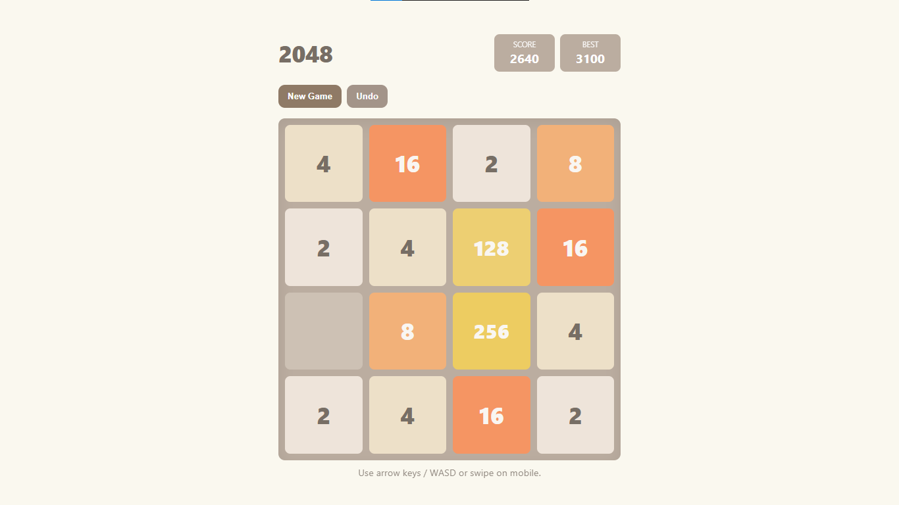
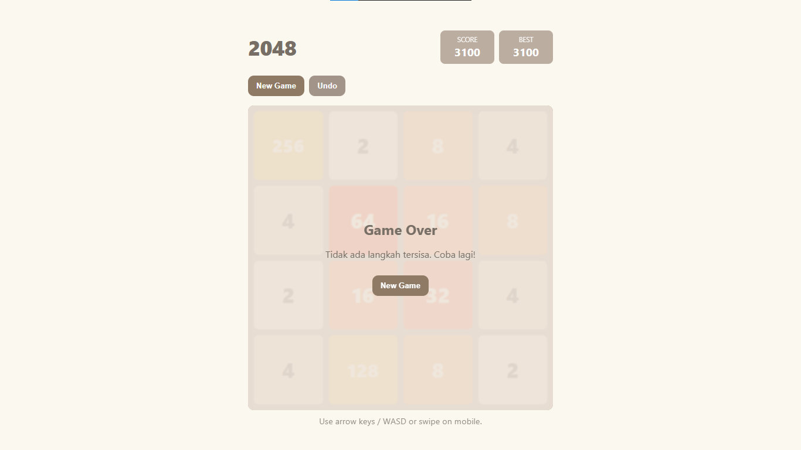

# Game_2048
Think, Swipe, Merge, Win - 2048 ✨

Selamat datang di **2048**, permainan puzzle sederhana namun adiktif yang menguji logika dan strategi kamu! Gabungkan ubin bernomor hingga mencapai angka **2048** — atau bahkan lebih tinggi, jika kamu bisa!

## 📖 Deskripsi
2048 adalah permainan berbasis grid 4x4 di mana pemain menggeser ubin bernomor untuk menggabungkan angka yang sama. Setiap kali dua ubin dengan angka yang sama bertemu, mereka menyatu menjadi satu ubin dengan jumlah angka tersebut. Tujuannya adalah mencapai ubin **2048** (atau lebih tinggi), sekaligus mempertahankan ruang bergerak selama mungkin.

Permainan berakhir saat grid penuh dan tidak ada lagi langkah yang bisa dilakukan.

## 🎮 Cara Bermain
- Gunakan tombol panah (`↑`, `↓`, `←`, `→`) untuk menggeser semua ubin ke arah yang diinginkan.
- Dua ubin dengan angka yang sama akan bergabung menjadi satu saat bertabrakan.
- Setiap langkah, sebuah ubin baru (dengan nilai **2** atau **4**) muncul secara acak di grid.
- Gabungkan ubin hingga kamu mencapai **2048** atau lebih!
- Game berakhir jika tidak ada langkah yang tersisa.

## 🖼️ Screenshot

### 1. Gameplay


> *Pada gambar di atas, pemain telah berhasil menggabungkan beberapa ubin dan membentuk angka 512. Grid masih memiliki ruang untuk berkembang, dan strategi mulai terbentuk di sekitar pojok kiri bawah sebagai titik fokus penyatuan.*

### 2. Game Over


> *Permainan berakhir karena grid telah penuh dan tidak ada lagi pasangan ubin yang bisa digabung. Meskipun pemain telah mencapai 1024, langkah selanjutnya tidak memungkinkan. Ini mengingatkan kita bahwa strategi jangka panjang dan manajemen ruang sangat penting dalam 2048!*

## 🚀 Fitur
- Animasi halus saat ubin bergabung
- Skor real-time dan skor tertinggi (high score)
- Tombol "Ulang" untuk memulai permainan baru
- Responsif — bisa dimainkan di desktop maupun mobile

## 🔧 Cara Menjalankan
1. Clone repositori ini:
   ```bash
   git clone https://github.com/rahmayani-maya/Game_2048.git
